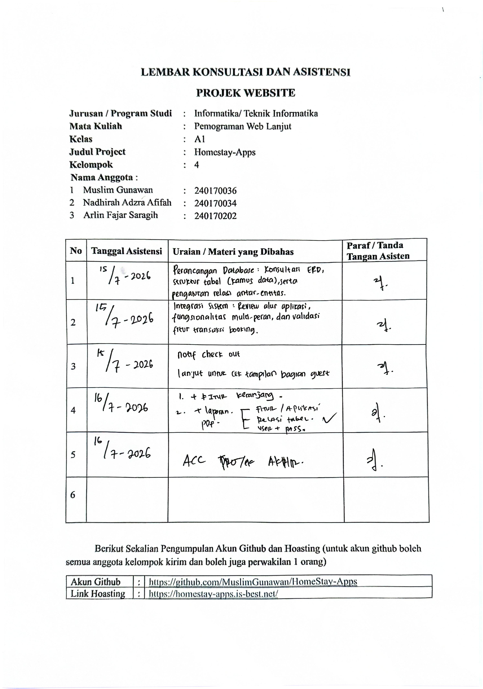
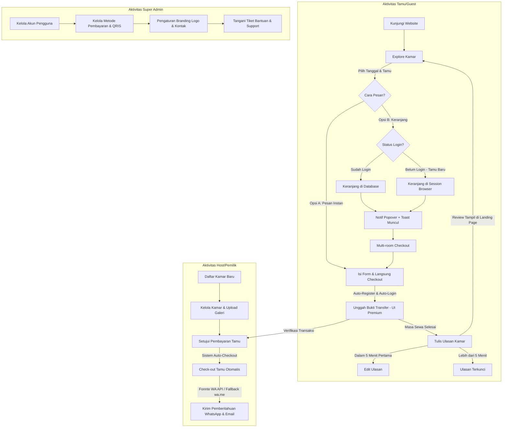
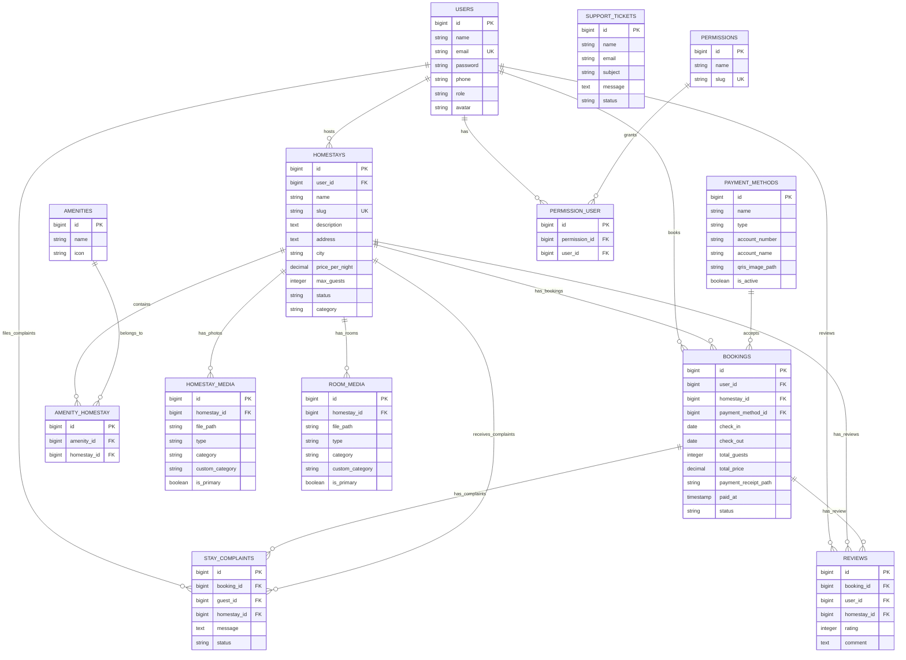

# Yuri Homestay Lhokseumawe (HomeStay-Apps)

HomeStay-Apps adalah platform pemesanan kamar homestay/penginapan berbasis web modern. Aplikasi ini dirancang menggunakan **Laravel 13**, **Inertia.js v3**, **React 19**, **Tailwind CSS v4**, dan **MySQL** untuk memberikan pengalaman Single Page Application (SPA) yang sangat cepat, interaktif, dan berestetika mewah (*glassmorphism & gold accent*).

---

## 📜 Lembar Konsultasi & Persetujuan UAS (ACC Dosen)

Berikut adalah bukti lembar konsultasi projek yang telah disetujui (ACC) oleh dosen pengampu mata kuliah Pemrograman Aplikasi Web Lanjut:

<div align="center">
  
</div>

---

## 🔄 Alur & Flowchart Visual Sistem (Visual Web Workflows)

Berikut adalah diagram alur interaksi multi-role (Tamu, Host, Admin) dalam ekosistem pemesanan Yuri Homestay:



---

## 🛠️ Stack Teknologi & Fitur Unggulan

- **Backend:** Laravel 13 (PHP 8.5), Fortify (Authentication).
- **Frontend:** React 19, Inertia.js v3 (dengan XHR built-in client, deferred props, polling), Tailwind CSS v4.
- **Database:** MySQL (Database relasional handal untuk manajemen transaksi penginapan).
- **Keranjang Belanja Multi-Kamar (Shopping Cart):**
  - Tamu yang **belum login** dapat langsung menggunakan keranjang (item disimpan di session browser).
  - Tamu yang **sudah login** keranjangnya tersimpan di database (`cart_items`).
  - Saat klik tombol "Ke Keranjang", halaman **tidak berpindah** — muncul 2 notifikasi interaktif: popover di atas tombol + floating toast di pojok kanan bawah.
  - Checkout multi-kamar sekaligus dalam 1 transaksi pembayaran.
- **Sistem Auto-Checkout & Pemberitahuan Otomatis:** Perintah terjadwal (`app:auto-checkout-guests`) otomatis men-checkout tamu saat masa huni habis, mengirimkan email terima kasih (SMTP), dan mengarahkan WhatsApp otomatis (mengintegrasikan Fonnte API Gateway).
- **Upload Bukti Transfer Premium:** Zona drag-and-drop bergaya premium untuk upload bukti transfer, lengkap dengan preview nama file & ukuran sebelum dikirim.
- **Fitur Proteksi Media:** 
  - Penempelan watermark transparan secara otomatis di backend menggunakan GD Library.
  - Penonaktifan klik kanan (`contextmenu`) dan penyeretan (`draggable="false"`) pada galeri foto.
  - Penempelan watermark link sumber otomatis saat menyalin teks deskripsi (*copy source watermark listener*).
- **Auto-Register Tamu:** Akun tamu otomatis terbuat secara instan saat melakukan checkout pemesanan kamar (termasuk checkout dari keranjang) tanpa harus mendaftar manual.
- **Batas Waktu Edit Ulasan:** Tamu hanya dapat mengedit ulasan dalam **5 menit** pertama setelah ulasan pertama ditulis. Setelah itu tombol edit otomatis tersembunyi.
- **Pusat Bantuan Terpadu:** Tombol WhatsApp dinamis langsung ke Host serta formulir tiket support terpusat ke Super Admin.

---

## 📋 Prasyarat Sistem & Tautan Unduh

Sebelum memulai instalasi, pastikan komputer Anda telah terinstal alat-alat berikut:

1. **Git Version Control**
   - Diperlukan untuk melakukan kloning kode sumber.
   - [Unduh Git untuk Windows](https://git-scm.com/downloads)
2. **PHP (Versi >= 8.3)**
   - Bahasa pemrograman backend utama.
   - Sangat disarankan mengunduh **Laragon** (menyediakan PHP, Apache, dan SQLite instan di Windows).
   - [Unduh Laragon](https://laragon.org/download/) atau [Unduh PHP Standalone](https://windows.php.net/download/)
3. **Composer**
   - Dependensi manajer untuk PHP.
   - [Unduh Composer](https://getcomposer.org/download/)
4. **Node.js (Versi >= 18) & NPM**
   - Lingkungan eksekusi untuk mengompilasi aset frontend React.
   - [Unduh Node.js](https://nodejs.org/en/download)

---

## 🚀 Panduan Instalasi Cepat (Otomatis via PowerShell)

Kami menyediakan skrip otomatisasi khusus Windows menggunakan PowerShell untuk memudahkan proses instalasi dari awal hingga siap digunakan.

### Langkah 1: Kloning Repositori
Buka Git Bash atau Command Prompt, lalu jalankan perintah:
```bash
git clone https://github.com/MuslimGunawan/HomeStay-Apps.git
cd HomeStay-Apps
```

### Langkah 2: Jalankan Script Setup
1. Buka **PowerShell** di Windows Anda.
2. Jika PowerShell Anda memblokir pengeksekusian skrip eksternal, jalankan perintah berikut untuk mengizinkannya (hanya berlaku pada sesi PowerShell saat ini):
   ```powershell
   Set-ExecutionPolicy RemoteSigned -Scope Process
   ```
3. Eksekusi skrip setup otomatis:
   ```powershell
   ./setup.ps1
   ```
    *Skrip ini otomatis menginstal dependensi Composer, menyalin file konfigurasi `.env`, memeriksa dan membuat database MySQL secara otomatis, menjalankan migrasi & seeder data sampel mewah, menginstal dependensi NPM, membuat link penyimpanan berkas (`storage:link`), serta mengompilasi aset statis frontend.*

### Langkah 3: Jalankan Aplikasi
Setelah setup selesai dengan sukses, jalankan perintah berikut di PowerShell untuk membuka server lokal dan browser Anda secara otomatis:
```powershell
./start.ps1
```
Aplikasi Anda akan segera terbuka dan berjalan di browser Anda pada alamat: **http://localhost:8000**

---

## 🔧 Panduan Instalasi Manual (Langkah-demi-Langkah)

Jika Anda ingin menginstal secara manual tanpa skrip PowerShell, ikuti langkah-langkah berikut setelah melakukan kloning:

1. **Instal Dependensi PHP:**
   ```bash
   composer install
   ```
2. **Buat File Konfigurasi `.env`:**
   ```bash
   copy .env.example .env
   ```
3. **Generate Kunci Aplikasi:**
   ```bash
   php artisan key:generate
   ```
4. **Buat Database MySQL:**
   - Pastikan server MySQL Anda aktif (misalnya via Laragon atau XAMPP).
   - Buat database baru bernama `homestay_apps` melalui MySQL client pilihan Anda (misalnya HeidiSQL, phpMyAdmin, atau command line):
     ```sql
     CREATE DATABASE homestay_apps CHARACTER SET utf8mb4 COLLATE utf8mb4_unicode_ci;
     ```
   - Sesuaikan konfigurasi database Anda di file `.env` (isi `DB_DATABASE=homestay_apps`, `DB_USERNAME=root`, dan `DB_PASSWORD=`).
5. **Jalankan Migrasi & Seeder Database:**
   ```bash
   php artisan migrate:fresh --seed
   ```
6. **Instal Dependensi Frontend & Compile:**
   ```bash
   npm install
   npm run build
   ```
7. **Hubungkan Symlink Penyimpanan Berkas:**
   ```bash
   php artisan storage:link
   ```
8. **Jalankan Server Lokal:**
   ```bash
   composer run dev
   ```
   Buka peramban Anda dan akses **http://localhost:8000**.

---

## 🔑 Kredensial Login Akun Sampel (Seeded Data)

Untuk memudahkan pengujian fungsionalitas multi-role, database seeder kami telah menyediakan akun-akun berikut dengan password default: `password`

| Peran (Role) | Email | Deskripsi Akses |
| :--- | :--- | :--- |
| **Super Admin** | `admin@homestay.com` | Mengelola metode pembayaran, branding logo, user, amenities global, dan tiket support. |
| **Host (Pemilik)** | `host@homestay.com` | Mengelola kamar (CRUD), persetujuan reservasi, keluhan tamu, & memantau stays. |
| **Guest (Tamu)** | `guest@homestay.com` | Memesan kamar, melihat e-receipt, menyukai wishlist, mengirim keluhan, & menulis review. |

---

## 🎯 Fitur & Alur Kerja Pengguna

1. **Eksplorasi & Reservasi Kamar:** Tamu memilih tanggal masuk/keluar di kalender, mengisi form pesanan (nama, nomor WA, email, bank transfer), lalu menekan tombol pesan.
2. **Keranjang Belanja (Tanpa Login):** Tamu — termasuk pengunjung baru yang belum punya akun — dapat langsung menambahkan beberapa kamar ke keranjang, meninjau total biaya, lalu checkout sekaligus. Sistem akan **auto-register** dan **auto-login** saat checkout.
3. **Auto-Register & Auto-Login:** Sistem otomatis mendaftarkan akun tamu tersebut, menghasilkan password sementara yang aman, mengautentikasikannya, serta menampilkan struk pemesanan beserta password sementara.
4. **Unggah Bukti Transfer:** Tamu mentransfer secara manual ke rekening bank/QRIS milik Yuri Homestay dan mengunggah bukti bayarnya melalui zona upload premium bergaya drag-and-drop.
5. **Persetujuan Host:** Pemilik homestay (Host) atau Admin memverifikasi bukti transfer dan menyetujui reservasi agar berstatus `confirmed` (terkonfirmasi).
6. **Pemantauan Kamar & Komunikasi:** Tamu yang sedang menginap dapat mengirim keluhan/aduan langsung dari dasbor tamu ke pemilik homestay. Tamu juga dapat menghubungi WhatsApp Host melalui tombol dinamis yang disediakan.
7. **Sistem Ulasan (Review) dengan Batas Waktu Edit:** Setelah waktu tinggal selesai, tamu dapat memberikan nilai rating (1-5 bintang) dan komentar ulasan. Ulasan dapat **diedit dalam 5 menit** pertama sejak ditulis, setelah itu tombol edit tersembunyi otomatis.

---

## 📊 Skema Database & Relasi

Aplikasi ini menggunakan database **MySQL** dengan skema relasi terstruktur sebagai berikut:

### 1. Tabel Utama & Kolom Penting

- **`users`**: Menyimpan data akun pengguna sistem.
  - `role`: Enum (`admin`, `host`, `guest`) yang mendefinisikan peran pengguna.
  - `phone`: Nomor telepon pengguna untuk keperluan koordinasi/komunikasi.
  - `avatar`: Path file foto profil pengguna.
  - Serta kolom bawaan Fortify untuk otentikasi (2FA, passkeys).
- **`homestays`**: Menyimpan data unit penginapan/homestay yang didaftarkan oleh Host.
  - `user_id`: Kunci tamu (foreign key) ke pemilik homestay (Host).
  - `price_per_night`: Harga sewa per malam (Decimal).
  - `max_guests`: Kapasitas maksimal tamu.
  - `status`: Status ketersediaan kamar (`active`, `inactive`).
  - `category`: Kategori homestay (Deluxe, Executive, Heritage, Family).
- **`amenities`**: Fasilitas global yang dapat ditautkan ke homestay (misal: Wi-Fi, AC, Kolam Renang).
  - `icon`: Menyimpan emoji atau nama icon visual pendukung.
- **`payment_methods`**: Metode pembayaran transfer bank/QRIS yang dikelola Super Admin.
  - `type`: Jenis pembayaran (`bank`, `ewallet`, `qris`).
  - `account_number` & `account_name`: Rekening tujuan transfer.
- **`bookings`**: Transaksi pemesanan kamar oleh Tamu (Guest).
  - `status`: Alur status booking (`pending_payment`, `pending_approval`, `confirmed`, `completed`, `cancelled`).
  - `payment_receipt_path`: File bukti transfer yang diunggah oleh Tamu.
- **`cart_items`**: Item keranjang belanja untuk pemesanan multi-kamar sekaligus.
  - `user_id`: Referensi ke akun tamu yang memiliki keranjang.
  - `homestay_id`: Referensi ke kamar yang ditambahkan ke keranjang.
  - `check_in` & `check_out`: Tanggal reservasi yang dipilih per item keranjang.
  - `total_guests`: Jumlah tamu untuk item kamar tersebut.
- **`reviews`**: Penilaian rating (1-5 bintang) dan komentar ulasan dari Tamu pasca check-out.
- **`stay_complaints`**: Sistem pengaduan keluhan Tamu langsung ke Host selama masa menginap.
- **`support_tickets`**: Layanan aduan/pertanyaan pengguna ke Super Admin.
- **`homestay_media` & `room_media`**: Menyimpan file foto/video eksterior dan interior homestay yang dilindungi watermark dinamis di backend.

### 2. Diagram Hubungan Relasi (ERD - Entity Relationship Diagram)

Berikut adalah diagram relasi entitas visual menggunakan Mermaid yang menunjukkan tabel, kolom kunci, tipe data, dan relasi hubungan antar tabel secara terperinci:



### 3. Pemetaan Hubungan Model Eloquent (Backend)

Secara programatik di dalam kode Laravel, relasi tersebut dideklarasikan sebagai berikut:

- **`User` (Host)** ➔ **Has Many** ➔ `Homestay` *(Satu host mengelola banyak penginapan)*
- **`User` (Guest)** ➔ **Has Many** ➔ `Booking` / `Review` *(Satu tamu memiliki banyak riwayat transaksi & ulasan)*
- **`Homestay`** ➔ **Belongs To** ➔ `User` (Host)
- **`Homestay`** ➔ **Has Many** ➔ `Booking` / `Review` / `HomestayMedia` / `RoomMedia` / `StayComplaint`
- **`Homestay`** ➔ **Belongs To Many** ➔ `Amenity` *(Hubungan banyak-ke-banyak via tabel pivot `amenity_homestay`)*
- **`Booking`** ➔ **Belongs To** ➔ `User` (Guest) & `Homestay` & `PaymentMethod`
- **`Booking`** ➔ **Has Many** ➔ `StayComplaint`
- **`Booking`** ➔ **Has One** ➔ `Review`
- **`Review`** ➔ **Belongs To** ➔ `User` (Guest) & `Homestay` & `Booking`
- **`StayComplaint`** ➔ **Belongs To** ➔ `Booking` & `User` (Guest) & `Homestay`
- **`User`** ➔ **Belongs To Many** ➔ `Permission` *(Hubungan banyak-ke-banyak via tabel pivot `permission_user` untuk mengontrol hak akses Host)*

